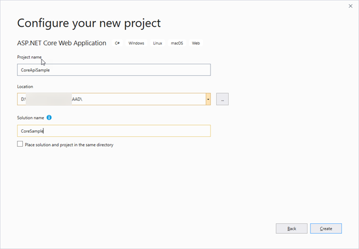
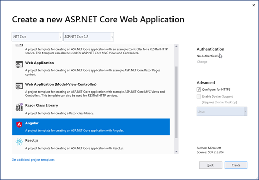

# Angular 7 Web App with .NET Core Web API and AAD Auth with MSAL

This repo contains a sample application created with Visual Studio 2019 using .NET Core 2.2 and Angular 7.


## Initial Setup

**IMPORTANT**

If you don't already have it, I highly recommend Mads Kristensen's [Open Command Line Visual Studio Extension](http://vsixgallery.com/extension/f4ab1e64-5d35-4f06-bad9-bf414f4b3bbb/), which I use to open a command line for all of the work done in building this sample.

See [_initialSetup/_initialSetupReadme.md](./_initialSetup/_initialSetupReadme.md) and follow the instructions there to copy the files `authconfig-dev-local.ts` and `authconfig-prod.ts` from `_initialSetup\alt-auth` in the root of this solution to
`CoreApiSample\ClientApp\src\app-alt\shared\auth`.

You will see additional instructions below in this readme about setting the values in those files.

You will also need the library [Microsoft.Identity.Web](./_docs/MS_Identity_Web.md).  
Follow [this link](./_docs/MS_Identity_Web.md) to see how to build the library for use with this sample.

## Environment

Quick information on environment.

### Node/NPM

```cmd
node --version
v9.11.1

npm --version
6.0.1
```

### Angular 7


### .NET


## Take 1 - Starting from VS2019 GUI

Start Visual Studio 2019 and see the dialog below:


Click on "Create a new project", or if the above dialog was dismissed,  choose File -- New Project.


Filter by Project type `Web` and then click on `ASP.Net Core Web Application` and click `Next`.



Set the Project name, Location and Solution name and click `Create`.



Choose Angular and click `Create`.

Now build and run the application.

## Update Angular 6 to 7

### Node and npm

Updated Node to `10.16.0` with [Windows install download](https://nodejs.org/en/download/)
from nodejs.org

Updated npm to `6.9.0` with [npm-windows-upgrade](https://www.npmjs.com/package/npm-windows-upgrade)
using PowerShell as admin.  (See notes on package page)

### Angular CLI

Uninstalled `@angular/cli` and installed version 7.3.8 (latest V7 release)
```cmd
npm uninstall -g angular-cli
npm cache verify (because npm > 5)
npm install -g @angular/cli@7.3.8
```
caused update of `@angular/cli` in `package.json`.

### Angular core

```cmd
ng update
```
got
```cmd
    We analyzed your package.json, there are some packages to update:

      Name                                      Version                  Command to update
     ---------------------------------------------------------------------------------------
      @angular/cli                              7.3.8 -> 8.0.3           ng update @angular/cli
      @angular/core                             6.0.5 -> 8.0.2           ng update @angular/core
      @angular/core                             6.1.10 -> 7.2.15         ng update @angular/core
      @nguniversal/aspnetcore-engine            6.0.0 -> 7.1.1           ng update @nguniversal/aspnetcore-engine
      rxjs                                      6.2.1 -> 6.5.2           ng update rxjs


    There might be additional packages that are outdated.
    Run "ng update --all" to try to update all at the same time.
```

Ran update of CLI:
```cmd
ng update @angular/cli@7.3.8
```
Caused no additional changes in `package.json`, but some changes
in `package-lock.json`.

```cmd
ng update @angular/core@7.0.0
```
updated multiple packages in `package.json`.

```cmd
ng update
```
got
```cmd
    We analyzed your package.json, there are some packages to update:

      Name                                      Version                  Command to update
     ---------------------------------------------------------------------------------------
      @angular/cli                              7.3.8 -> 8.0.3           ng update @angular/cli
      @angular/core                             7.2.15 -> 8.0.2          ng update @angular/core
      @angular/core                             7.0.0 -> 7.2.15          ng update @angular/core
      @nguniversal/aspnetcore-engine            6.0.0 -> 7.1.1           ng update @nguniversal/aspnetcore-engine


    There might be additional packages that are outdated.
    Run "ng update --all" to try to update all at the same time.
```

```cmd
ng update @angular/core@7.2.15
```
made additional changes in in `package.json`.
```cmd
ng update
```
got
```cmd
    We analyzed your package.json, there are some packages to update:

      Name                                      Version                  Command to update
     ---------------------------------------------------------------------------------------
      @angular/cli                              7.3.8 -> 8.0.3           ng update @angular/cli
      @angular/core                             7.2.15 -> 8.0.2          ng update @angular/core
      @nguniversal/aspnetcore-engine            6.0.0 -> 7.1.1           ng update @nguniversal/aspnetcore-engine


    There might be additional packages that are outdated.
    Run "ng update --all" to try to update all at the same time.
```

Compiled and ran and app runs successfully.

results of npm install before build included notification of vulnerabilities.

See document on [npm audit](./_docs/npm_audit.md)

## Configure App settings in Azure Portal

[Register the application for your Azure Active Directory](./_docs/CNS_AzureAppRegistration.md)

## Set up API for Azure AD Auth

Add the NuGet package Microsoft.AspNetCore.Authentication.AzureAD.UI.

Add a reference to Microsoft.Identity.Web.dll.  e.g. Add the dependency or add the following to CoreApiSample.cs:
```xml
  <ItemGroup>
    <Reference Include="Microsoft.Identity.Web">
      <HintPath>..\..\_Binaries\Microsoft.Identity.Web.dll</HintPath>
    </Reference>
  </ItemGroup>
```

Add the following to `Startup.ConfigureServices`:
```cs
        public void ConfigureServices(IServiceCollection services)
        {
            services.AddProtectWebApiWithMicrosoftIdentityPlatformV2(Configuration)
                    .AddProtectedApiCallsWebApis(Configuration)
                    .AddInMemoryTokenCaches();
            //...
```

Add the following to `Startup.Configure`

Change from:
```cs
            app.UseHttpsRedirection();
            app.UseStaticFiles();
```
to
```cs
            app.UseHttpsRedirection();
            app.UseAuthentication();
            app.UseStaticFiles();
```

Add the following to `appsettings.json`:
```json
  "AzureAd": {
    "Instance": "https://login.microsoftonline.com/",
    "ClientIdComment": "Enter_client_ID_Of_TodoListService-v2_from_Azure_Portal _eg_2ec40e65-ba09-4853-bcde-bcb60029e596",
    "ClientId": "00000000-0000-0000-0000-000000000000",
    "Comment": "You need specify the TenantId only if you want to accept access tokens from a single tenant (line of business app) Otherwise you can leave them set to common",
    "Domain": "qualified.domain.name",
    "Comment2": "for instance contoso.onmicrosoft.com. Not used in the ASP.NET core template",
    "TenantId": "common",
    "Comment3": "The tenant's Directory ID (a guid) or 'common' or 'organizations' or 'consumers'"
  },
```
Open the "User Secrets" json file (`secrets.json`) and add the following:
```json
  "AzureAd": {
    "Instance": "https://login.microsoftonline.com/",
    "ClientId": "00000000-0000-0000-0000-000000000000",
    "Domain": "qualified.domain.name",
    "TenantId": "00000000-0000-0000-0000-000000000000"
  }
```
and update the values for ClientId, Domain and TenantId.

Add the following `using` to `SampleDataController.cs` if not already present:
```cs
using Microsoft.AspNetCore.Authorization;
```

Add `[Authorize]` attribute to `SampleDataController` above
```cs
    public class SampleDataController : Controller
```

## Set up for Azure AD in Angular code

### Create _initialSetup

Create the folder `_initialSetup` in the root of the solution, and
create the folder `alt-auth` under it.

Create the file `authconfig-dev-local.ts` in `alt-auth`:
```json
import { AuthConfig } from "../../../app/shared/shared-config.models";

//Auth Configuration for local dev
//See notes in solution readme.md
export const AUTH_CONFIG: AuthConfig = {
  apiAsUserScope: "api://00000000-0000-0000-0000-000000000000/access_as_user",
  appPostLogoutRedirectUri: "https://localhost:44396",
  appRedirectUri: "https://localhost:44396",
  authConfigType: "dev-local",
  authority: "https://login.microsoftonline.com/_my_tenant_.onmicrosoft.com",
  cacheLocation: "localStorage",
  clientId: "00000000-0000-0000-0000-000000000000",
  apiRoot: "https://localhost:44396"
}
```

Create the file `authconfig-prod.ts` in `alt-auth`:
```json
import { AuthConfig } from "../../../app/shared/shared-config.models";

//Auth Configuration for production
//See notes in solution readme.md
export const AUTH_CONFIG: AuthConfig = {
  apiAsUserScope: "api://00000000-0000-0000-0000-000000000000/access_as_user",
  appPostLogoutRedirectUri: "https://localhost:44396",
  appRedirectUri: "https://localhost:44396",
  authConfigType: "prod",
  authority: "https://login.microsoftonline.com/_my_tenant_.onmicrosoft.com",
  cacheLocation: "localStorage",
  clientId: "00000000-0000-0000-0000-000000000000",
  apiRoot: "https://localhost:44396"
}
```

### Create app\shared, app-alt and subfolders

Create the following folders in the project tree
```txt
...\ClientApp\src\app\shared
...\ClientApp\src\app\shared\auth

...\ClientApp\src\app-alt
...\ClientApp\src\app-alt\shared
...\ClientApp\src\app-alt\shared\auth
```

### Add config for auth

Add the file `...\ClientApp\src\app-alt\shared\auth\.gitignore`:
```txt
# DO NOT version authconfig-xxx.ts files here!
authconfig*.ts
```

Add the file `...\ClientApp\src\app\shared\shared-config.models.ts`:
```TypeScript
export interface AuthConfig {
  apiAsUserScope: string;
  appPostLogoutRedirectUri: string;
  appRedirectUri: string;
  authConfigType: string;
  authority: string;
  cacheLocation: string;
  clientId: string;
  apiRoot: string;
}
```

Add the file `...\ClientApp\src\app\shared\auth\authconfig.ts`:
```TypeScript
import { AuthConfig } from "../../../app/shared/shared-config.models";

//*** Important *** The values in this file in .../ClientApp/src/app/shared/auth
//will be replaced by the contents of a file from .../ClientApp/src/app-alt/shared/auth
//
// See readme.md from root of solution for more information
export const AUTH_CONFIG: AuthConfig = {
  apiAsUserScope: "api://00000000-0000-0000-0000-000000000000/access_as_user",
  appPostLogoutRedirectUri: "https://localhost:44396",
  appRedirectUri: "https://localhost:44396",
  authConfigType: "empty",
  authority: "https://login.microsoftonline.com/_my_tenant_.onmicrosoft.com",
  cacheLocation: "localStorage",
  clientId: "00000000-0000-0000-0000-000000000000",
  apiRoot: "https://localhost:44396"
}
```

### Update angular.json to copy configuration

Changes in `angular.json` in section under "configurations" (starting at line 32) from:
```json
          "configurations": {
            "production": {
              "fileReplacements": [
                {
                  "replace": "src/environments/environment.ts",
                  "with": "src/environments/environment.prod.ts"
                }
              ],
              "optimization": true,
              "outputHashing": "all",
              "sourceMap": false,
              "extractCss": true,
              "namedChunks": false,
              "aot": true,
              "extractLicenses": true,
              "vendorChunk": false,
              "buildOptimizer": true
            }
          }
```
to
```json
          "configurations": {
            "production": {
              "fileReplacements": [
                {
                  "replace": "src/environments/environment.ts",
                  "with": "src/environments/environment.prod.ts"
                },
                {
                  "replace": "src/app/shared/auth/authconfig.ts",
                  "with": "src/app-alt/shared/auth/authconfig-prod.ts"
                }
              ],
              "optimization": true,
              "outputHashing": "all",
              "sourceMap": false,
              "extractCss": true,
              "namedChunks": false,
              "aot": true,
              "extractLicenses": true,
              "vendorChunk": false,
              "buildOptimizer": true
            },
            "dev-local": {
              "fileReplacements": [
                {
                  "replace": "src/app/shared/auth/authconfig.ts",
                  "with": "src/app-alt/shared/auth/authconfig-dev-local.ts"
                }
              ]
            }
          }
```

### Move the definitions for Routes
Change routes in `app.module.ts` from:
```TypeScript
    RouterModule.forRoot([
      { path: '', component: HomeComponent, pathMatch: 'full' },
      { path: 'counter', component: CounterComponent },
      { path: 'fetch-data', component: FetchDataComponent },
    ])
```
to
```TypeScript
    RouterModule.forRoot(appRoutes, { useHash: true })
```
and add `app.routes.ts`:
```TypeScript
import { Routes } from '@angular/router';
import { CounterComponent } from './counter/counter.component';
import { FetchDataComponent } from './fetch-data/fetch-data.component';
import { HomeComponent } from './home/home.component';

export const appRoutes: Routes = [
  { path: 'home', component: HomeComponent, pathMatch: 'full' },
  { path: 'counter', component: CounterComponent },
  { path: 'fetch-data', component: FetchDataComponent },
];
```
### Update the navigation menu

change `nav-menu.component.ts` from:
```TypeScript
import { Component } from '@angular/core';

@Component({
  selector: 'app-nav-menu',
  templateUrl: './nav-menu.component.html',
  styleUrls: ['./nav-menu.component.css']
})
export class NavMenuComponent {
  isExpanded = false;

  collapse() {
    this.isExpanded = false;
  }

  toggle() {
    this.isExpanded = !this.isExpanded;
  }
}
```
to
```TypeScript
import { Component } from '@angular/core';
import { Subscription } from "rxjs";
import { BroadcastService, MsalService } from "@azure/msal-angular";

@Component({
  selector: 'app-nav-menu',
  templateUrl: './nav-menu.component.html',
  styleUrls: ['./nav-menu.component.css']
})
export class NavMenuComponent {
  static VER: string = "1.02";
  isExpanded: boolean = false;
  isLoggedIn = false;
  private loginFailedSubscription: Subscription = null;
  private loginOkSubscription: Subscription = null;

  constructor(private broadcastService: BroadcastService, private msalService: MsalService) {
    console.log("navMenu constructor v=" + NavMenuComponent.VER);
  }

  collapse() {
    this.isExpanded = false;
  }

  logout(): void {
    console.log("logout");
    this.msalService.logout();
    this.isLoggedIn = false;
  }

  //extremely important to unsubscribe
  ngOnDestroy() {
    console.log("navMenu component OnDestroy");
    this.broadcastService.getMSALSubject().next(1);
    if (this.loginFailedSubscription) {
      this.loginFailedSubscription.unsubscribe();
    }
    if (this.loginOkSubscription) {
      this.loginOkSubscription.unsubscribe();
    }
  }

  ngOnInit() {
    let user: any = this.msalService.getUser();
    this.isLoggedIn = (user != null);
    console.log("navMenu OnInit v=" + NavMenuComponent.VER + " - isLoggedIn=" + this.isLoggedIn);
    //if (this.isLoggedIn) { console.log(user); }
    this.loginFailedSubscription = this.broadcastService.subscribe("msal:loginFailure", (payload) => {
      console.log("navMenu login failed");
      this.isLoggedIn = false;
    });
    this.loginOkSubscription = this.broadcastService.subscribe("msal:loginSuccess", (payload) => {
      console.log("navMenu login success");
      this.isLoggedIn = true;
    });
  }

  toggle() {
    this.isExpanded = !this.isExpanded;
  }

}
```

Change `` from:
```html
<header>
  <nav class='navbar navbar-expand-sm navbar-toggleable-sm navbar-light bg-white border-bottom box-shadow mb-3'>
    <div class="container">
      <a class="navbar-brand" [routerLink]='["/"]'>CoreApiSample</a>
      <button class="navbar-toggler" type="button" data-toggle="collapse" data-target=".navbar-collapse" aria-label="Toggle navigation"
        [attr.aria-expanded]="isExpanded" (click)="toggle()">
        <span class="navbar-toggler-icon"></span>
      </button>
      <div class="navbar-collapse collapse d-sm-inline-flex flex-sm-row-reverse" [ngClass]='{"show": isExpanded}'>
        <ul class="navbar-nav flex-grow">
          <li class="nav-item" [routerLinkActive]='["link-active"]' [routerLinkActiveOptions]='{ exact: true }'>
            <a class="nav-link text-dark" [routerLink]='["/"]'>Home</a>
          </li>
          <li class="nav-item" [routerLinkActive]='["link-active"]'>
            <a class="nav-link text-dark" [routerLink]='["/counter"]'>Counter</a>
          </li>
          <li class="nav-item" [routerLinkActive]='["link-active"]'>
            <a class="nav-link text-dark" [routerLink]='["/fetch-data"]'>Fetch data</a>
          </li>
        </ul>
      </div>
    </div>
  </nav>
</header>
```
to
```html
<header>
  <nav class='navbar navbar-expand-sm navbar-toggleable-sm navbar-light bg-white border-bottom box-shadow mb-3'>
    <div class="container">
      <a class="navbar-brand" [routerLink]='["/"]'>CoreApiSample</a>
      <button class="navbar-toggler" type="button" data-toggle="collapse" data-target=".navbar-collapse" aria-label="Toggle navigation"
        [attr.aria-expanded]="isExpanded" (click)="toggle()">
        <span class="navbar-toggler-icon"></span>
      </button>
      <div class="navbar-collapse collapse d-sm-inline-flex flex-sm-row-reverse" [ngClass]='{"show": isExpanded}'>
        <ul class="navbar-nav flex-grow">
          <li class="nav-item" [routerLinkActive]='["link-active"]' [routerLinkActiveOptions]='{ exact: true }'>
            <a class="nav-link text-dark" [routerLink]='["/"]'>Home</a>
          </li>
          <li class="nav-item" [routerLinkActive]='["link-active"]'>
            <a class="nav-link text-dark" [routerLink]='["/counter"]'>Counter</a>
          </li>
          <li class="nav-item" [routerLinkActive]='["link-active"]'>
            <a class="nav-link text-dark" [routerLink]='["/fetch-data"]'>Fetch data</a>
          </li>
          <li *ngIf="isLoggedIn">
            <button (click)="logout()">Logout</button>
          </li>
        </ul>
      </div>
    </div>
  </nav>
</header>
```

### Add MsalGuard to item in routes

Add import of MsalGuard in `app.routes.ts`:
```TypeScript
import { MsalGuard } from "@azure/msal-angular";
```

Change entry in Routes (`app.routes.ts`) from:
```TypeScript
  { path: 'fetch-data', component: FetchDataComponent },
```
to
```TypeScript
  { path: 'fetch-data', component: FetchDataComponent, canActivate: [MsalGuard] },
```


## Resources

See the following pages for additional resources

[Developer Tool Notes](./_docs/CNS_DevToolNotes.md)

[Azure Active Directory Resources](./_docs/AzureADResources.md)

Additional resources: [Resources](./_docs/CNS_Resources.md)

## Dev Notes

[Developer Notes](./_docs/CoreSampleDevNotes.md)
