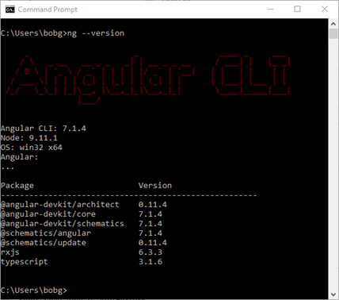
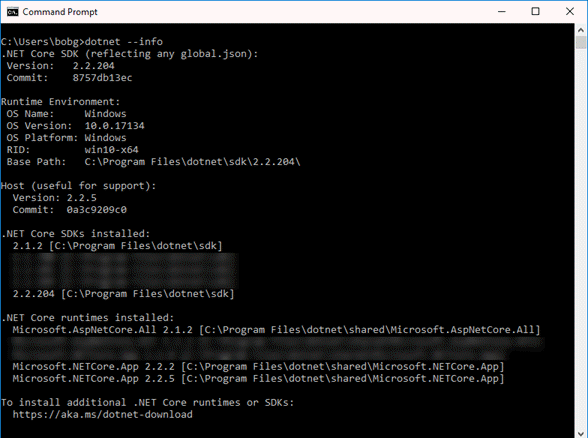
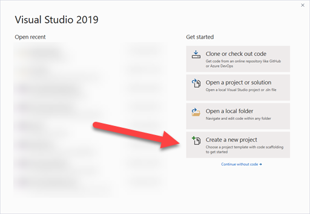
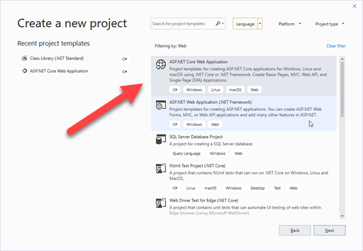

# Angular 7 Web App with .NET Core Web API and AAD Auth with MSAL

## Environment

Quick information on environment.

### Node/NPM

```cmd
node --version
v9.11.1

npm --version
6.0.1
```

### Angular 7


### .NET


## Take 1 - Starting from VS2019 GUI

Start Visual Studio 2019 and see the dialog below:



Click on "Create a new project", or if the above dialog was dismissed,  choose File -- New Project.



Filter by Project type `Web` and then click on `ASP.Net Core Web Application` and click `Next`.

